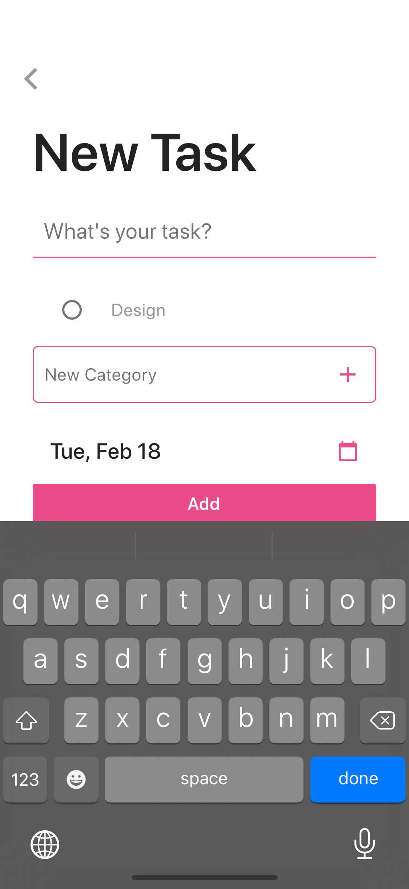

  

    
    <h1 align="center" style="font-size: 48px; font-weight: bold;">Dribbbly</h1>
  

  <h2 align="center">A beautiful todo app built with Flutter
  </h2>

  Design is inspired with Dribbble & [Lucas Fernandes's Hello, Dribbble](https://dribbble.com/shots/5788100-Hello-Dribbble)

  

    
  

---

## Screens

  

    
    
    
    
  

## Main Features
- Record a task with date and category
- Light Theme & Dark Theme

## Main Stack
- Provider to manage state
- Sqflite for locally persistent data

## About

This is a small personal project. Any comments and reactions would be awesome!
